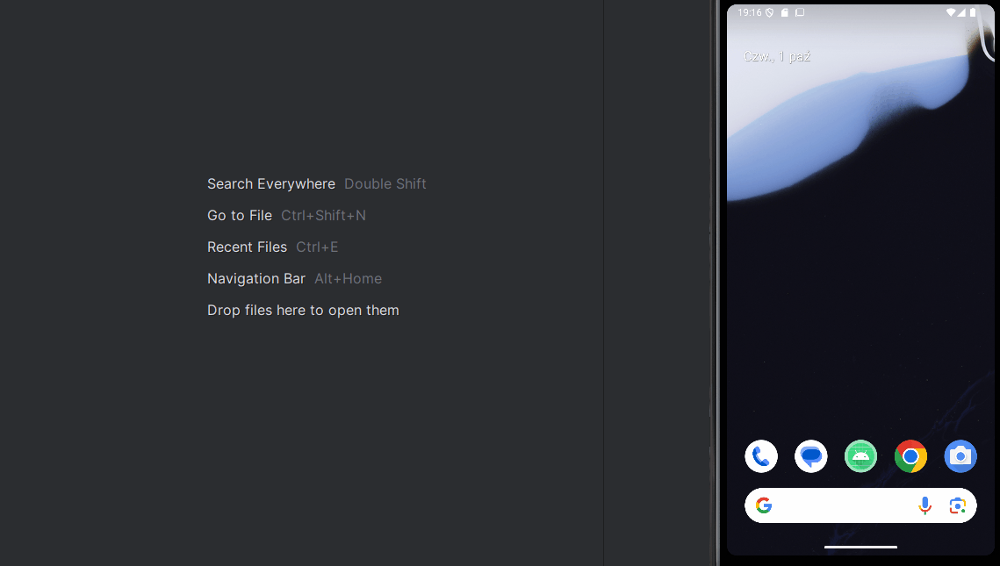
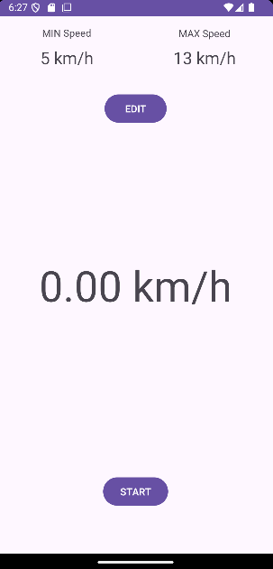
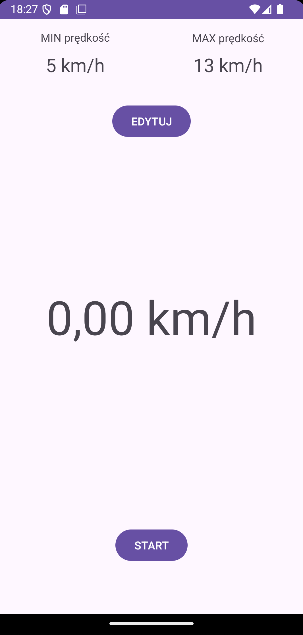
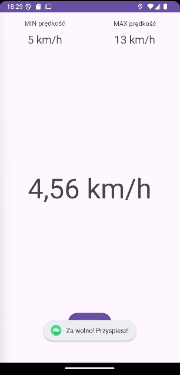
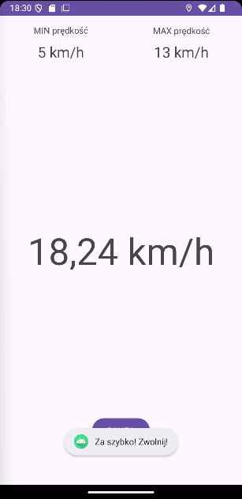
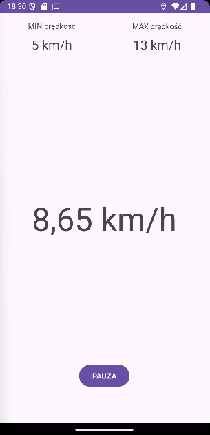

# Asystent Tempa Biegu - Narzędzie do kontroli i stabilizacji prędkości z wykorzystaniem GPS

Prosta i intuicyjna aplikacja mobilna na system Android, stworzona w języku Kotlin, służąca do precyzyjnego kontrolowania tempa i prędkości biegu z wykorzystaniem modułu GPS urządzenia.

---

## Demo / Prezentacja działania

Poniższa animacja przedstawia pełny cykl pracy w aplikacji (od konfiguracji sesji treningowej po aktywny monitoring): od uruchomienia aplikacji i wprowadzenia parametrów brzegowych (dolnej oraz górnej granicy prędkości w km/h), przez inicjalizację nasłuchiwania modułu GPS, aż po bieżącą kalkulację tempa w czasie rzeczywistym. W trakcie prezentacji zademonstrowano reakcję systemu na poszczególne stany telemetryczne: przekroczenie dolnego progu prędkości (ostrzeżenie o konieczności przyspieszenia), przekroczenie pułapu maksymalnego (alert o zbyt szybkim biegu) oraz stabilny bieg w zdefiniowanym korytarzu prędkości, w którym powiadomienia są automatycznie wyciszane.

<p align="center">
  
</p>

> [!NOTE]
> **Informacja dotycząca prezentacji na GIF-ie (Wersja demonstracyjna):**
> 1. **Powiadomienia wizualne (Toast):** W celach demonstracyjnych na nagraniu dodano widoczne komunikaty tekstowe. Wynika to z faktu, że plik GIF nie rejestruje dźwięku, a wibracje są wyczuwalne wyłącznie na fizycznym telefonie (emulator ich nie generuje).
> 2. **Symulacja GPS w emulatorze Android Studio:** Trasa i prędkość widoczne na nagraniu są generowane przez wbudowane narzędzie emulacji lokalizacji w Android Studio (*Extended Controls -> Location*). Wartości prędkości utrzymują się sztucznie na stałym poziomie przez dłuższe odcinki czasu, co wynika bezpośrednio ze stałych mnożników odtwarzania trasy (*Playback Speed*) w emulatorze. Dodatkowo wirtualny moduł GPS charakteryzuje się zauważalną bezwładnością przy dynamicznej zmianie prędkości odtwarzania odczyty pozycji aktualizują się z lekkim opóźnieniem. Wynika to wyłącznie ze specyfiki silnika symulacji środowiska Android Studio, a nie z wydajności czy logiki samej aplikacji.

---

## O projekcie

Projekt został wykonany w ramach zajęć „Projektowanie aplikacji mobilnych” na semestrze letnim 2023/2024, studiów pierwszego stopnia.

Utrzymanie stałego tempa to kluczowy element treningu biegowego zarówno dla amatorów dbających o odpowiednie tętno tlenowe, jak i dla profesjonalistów przygotowujących się do maratonów i zawodów długodystansowych. 

**Asystent Tempa Biegu** pozwala biegaczowi zdefiniować optymalny przedział prędkości (od dolnej do górnej granicy w km/h). Podczas biegu aplikacja stale monitoruje prędkość za pomocą GPS i natychmiast ostrzega użytkownika:
* **dźwiękowo** - gdy tempo spada poniżej dolnego limitu,
* **wibracjami** - gdy prędkość przekracza założony pułap maksymalny.

Dzięki temu biegacz nie musi stale patrzeć na ekran telefonu, skupiając się wyłącznie na technice biegu.

---

## Kluczowe funkcjonalności

* **Precyzyjny pomiar prędkości w czasie rzeczywistym:** Odczyt danych z `LocationManager` (GPS) z częstotliwością odświeżania nie dłuższą niż 1 sekunda oraz priorytetowym wykorzystaniem wbudowanego sensora prędkości (`location.hasSpeed()`).
* **Inteligentne filtrowanie anomalii GPS (Anti-teleportation filter):** Zabezpieczenie przed nagłymi skokami pozycji, zakłóceniami sygnału GPS lub restartem trasy (automatyczne ignorowanie fizycznie niemożliwych skoków prędkości > 50 km/h i reset punktu bazowego).
* **Personalizowane strefy prędkości:** Wygodne ustawianie dolnej (`Min`) oraz górnej (`Max`) granicy prędkości w km/h wraz z walidacją danych (np. blokada ustawienia limitu dolnego wyższego niż górny, filtr wprowadzania do 2 miejsc po przecinku).
* **Niezależne powiadomienia sensoryczne z buforem stabilizującym:**
  * **Sygnał dźwiękowy (`ToneGenerator`):** Cykliczny dźwięk ostrzegawczy informujący o konieczności przyspieszenia.
  * **Wibracje (`Vibrator` / `VibrationEffect`):** Impulsy wibracyjne informujące o zbyt szybkim biegu.
  * 3-sekundowy bufor stabilizujący zapobiegający fałszywym alarmom przy chwilowych wahaniach tempa.
* **Kontrola kolejkowania powiadomień (Throttling):** Dedykowany mechanizm zapobiegający zalewaniu użytkownika i systemu komunikatami (eliminacja kolejkowania toastów/alertów oraz natychmiastowe czyszczenie po powrocie do pożądanej strefy prędkości).
* **Zarządzanie stanem i oszczędzanie energii:** Automatyczne zatrzymywanie nasłuchiwania GPS w momencie przejścia aplikacji do tła (`onPause`), z możliwością bezpiecznego wznowienia (`onResume`).
* **Wielojęzyczność (i18n):** Pełne wsparcie dla języka polskiego (`values-pl`) oraz angielskiego (wartości domyślne).
* **Nowoczesny UI:** Zastosowanie dwukierunkowego wiązania danych (Android Data Binding).

---

## Zrzuty ekranu

<p align="center">
  
  <br>
  <em>Rysunek 1: Widok główny aplikacji w domyślnej wersji językowej (język angielski).</em>
</p>

<br>

<p align="center">
  
  <br>
  <em>Rysunek 2: Widok główny po automatycznym dostosowaniu do języka systemowego (internacjonalizacja - język polski).</em>
</p>

<br>

<p align="center">
  
  <br>
  <em>Rysunek 3: Aktywny monitoring prędkości - sygnalizacja przekroczenia dolnego limitu (tempo poniżej progu minimalnego).</em>
</p>

<br>

<p align="center">
  
  <br>
  <em>Rysunek 4: Aktywny monitoring prędkości - sygnalizacja przekroczenia górnego limitu (tempo powyżej pułapu maksymalnego).</em>
</p>

<br>

<p align="center">
  
  <br>
  <em>Rysunek 5: Bieg w zdefiniowanym korytarzu prędkości - brak powiadomień i praca w optymalnym tempie treningowym.</em>
</p>

---

## Technologie i narzędzia

* **Język programowania:** [Kotlin](https://kotlinlang.org/)
* **Platforma docelowa:** Android (minSdkVersion: API 19 / KitKat, targetSdkVersion: API 34 / Android 14)
* **Wzorzec architektoniczny / UI:** Single Activity (`MainActivity`), Android Data Binding
* **Komponenty systemowe i biblioteki:**
  * `Android Location (LocationManager, LocationListener)` - śledzenie lokalizacji i wyliczanie prędkości
  * `Android Media (ToneGenerator, AudioManager)` - obsługa sygnałów dźwiękowych
  * `Android OS (Vibrator, VibrationEffect)` - obsługa haptyki / wibracji
  * `AndroidX MultiDex` - obsługa aplikacji z dużą liczbą referencji metod
* **System budowania:** Gradle (Kotlin DSL: `build.gradle.kts`) z katalogiem wersji `libs.versions.toml`

---

## Instrukcja instalacji i uruchomienia

### Wymagania

* Środowisko **Android Studio** (wersja Hedgehog / Iguana / Jellyfish lub nowsza)
* Zainstalowane **Android SDK** z platformą API 34
* JDK w wersji 17 lub kompatybilnej
* Urządzenie fizyczne z systemem Android lub emulator z włączoną symulacją lokalizacji GPS

### Instrukcja

1. **Sklonuj repozytorium:**
   ```bash
   git clone https://github.com/AdiKungen/Projekt_PAM_Budny_Adrian_PAW3.git
   cd Projekt_PAM_Budny_Adrian_PAW3
   ```

2. **Otwórz projekt w Android Studio:**   
   * Wybierz opcję `File` -> `Open...` i wskaż sklonowany katalog główny projektu.
   * Poczekaj na zsynchronizowanie projektu przez narzędzie Gradle.

3. **Uruchomienie:**   
   * Podłącz urządzenie fizyczne z włączonym debugowaniem USB lub uruchom emulator Android Virtual Device (AVD).
   * Kliknij przycisk `Run 'app'` (zielony trójkąt) lub użyj skrótu `Shift + F10`.
   * Przy pierwszym uruchomieniu zatwierdź uprawnienia dostępu do precyzyjnej lokalizacji (`ACCESS_FINE_LOCATION`).

---

## Licencja / License

**PL:**  
Copyright (c) 2026 Adrian Budny. Wszelkie prawa zastrzeżone.  
Kod źródłowy tego projektu udostępniony jest wyłącznie do wglądu w celach demonstracji portfolio i weryfikacji umiejętności. Kopiowanie, modyfikowanie, rozpowszechnianie lub wykorzystywanie tego kodu w celach komercyjnych lub prywatnych bez pisemnej zgody autora jest zabronione.

**EN:**  
Copyright (c) 2026 Adrian Budny. All rights reserved.  
This source code is made publicly available solely for portfolio demonstration and technical evaluation. No permission is granted to copy, modify, distribute, or use this code for any commercial or non-commercial purpose without prior written consent from the author.
